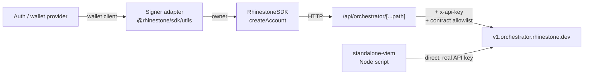

# e2e-examples

Reference integrations of the Rhinestone global wallet: deposit on any supported chain, spend on any other, one account address. Ten standalone example apps built on `@rhinestone/sdk` v2, pinned to a single SDK version through a pnpm workspace so the whole repo moves as one unit. These are demos and integration references — CI typechecks them, nothing here runs against a live orchestrator automatically.

## Examples

| Example            | Purpose                                          | Signer adapter                                     |
| ------------------ | ------------------------------------------------ | -------------------------------------------------- |
| `dynamic/`         | Dynamic wallet connection                        | `walletClientToAccount` (ECDSA)                    |
| `privy/`           | Privy auth + embedded wallets                    | `walletClientToAccount` (ECDSA)                    |
| `reown/`           | Reown AppKit (formerly WalletConnect)            | `walletClientToAccount` (ECDSA)                    |
| `para-viem/`       | Para via the Para viem SDK                       | `wrapParaAccount` (ECDSA, MPC v-byte fixup)        |
| `para-wagmi/`      | Para via the Para wagmi SDK                      | `walletClientToAccount` (ECDSA)                    |
| `magic/`           | Magic auth                                       | `walletClientToAccount` (ECDSA)                    |
| `passkey/`         | Passkey-only account, no auth provider           | `toWebAuthnAccount` (passkey owner)                |
| `session-keys/`    | Approve a scoped session once, then execute      | ECDSA owner + `experimental_session` signer        |
| `standalone-wagmi/`| Injected connector only, no auth provider        | `walletClientToAccount` (ECDSA)                    |
| `standalone-viem/` | Node script, no browser and no proxy             | `privateKeyToAccount` (ECDSA)                      |
| `backend/`         | CLI bundle generator for orchestrator intents    | git submodule ([bundle-generator](https://github.com/rhinestonewtf/bundle-generator)) |

Each example has its own `README.md` with a quickstart. Nine are Next.js apps; `standalone-viem` is a `tsx` script.

## Architecture

Browser examples never hold the orchestrator API key. Each app ships a catch-all Next.js route that injects `RHINESTONE_API_KEY` server-side, and the SDK is pointed at that route with a placeholder key:

```typescript
const rhinestone = new RhinestoneSDK({
  auth: { mode: "apiKey", apiKey: "proxy" },
  endpointUrl: `${window.location.origin}/api/orchestrator`,
});
```



The proxy is a public relay for whoever can reach the app, so it filters `intent-operations` bodies against a contract allowlist (`WHITELISTED_CONTRACTS`) before forwarding, keyed off `signedIntentOp.signedMetadata.account.accountContext.destinationExecutions`. Flip `ALLOW_ALL_CONTRACTS` to skip validation. See `session-keys/src/app/api/orchestrator/[...path]/route.ts` for an allowlist scoped to a real flow (USDC + the smart-session emissary).

`standalone-viem` has no proxy — it runs server-side and passes the real API key straight to the SDK.

### App shapes

Two UI families, worth knowing before editing one:

- **Portfolio dashboard** — `dynamic`, `privy`, `reown`, `para-viem`, `para-wagmi`, `magic`. A `useGlobalWallet` hook (`useRhinestoneWallet` in `magic`) returning `{ rhinestoneAccount, accountAddress, portfolio, isLoading, error, refreshPortfolio, sendCrossChainTransaction }`, rendered by `WalletSidebar` + `MainContent` (+ `DocumentationSection` in all but `magic`). The demo flow is a USDC transfer sourced from Arbitrum, settled on Base.
- **Single-card demo** — `passkey`, `session-keys`, `standalone-wagmi`. All logic inline in `src/app/page.tsx`, no shared hook.

The hooks are near-duplicates per app by design: each one is meant to be readable standalone and copy-pasteable into a user's project. Don't factor them into a shared package.

### Cross-chain transaction flow

1. `account.prepareTransaction({ sourceChains, targetChain, calls, tokenRequests })`
2. `account.signTransaction(prepared)`
3. `account.submitTransaction(signed)`
4. `account.waitForExecution(transaction)`

## Version pinning

Shared dependency versions live in the `catalog` in [`pnpm-workspace.yaml`](./pnpm-workspace.yaml). Bumping `@rhinestone/sdk` across every example is a one-line change there.

`scripts/check-sdk-version.mjs` (`pnpm check:sdk`) fails if any workspace package declares `@rhinestone/sdk` as anything other than `"catalog:"`. Combined with the typecheck job, that guarantees no example silently lags the pinned SDK. CI runs `check:sdk` then `typecheck` on push to `main` and on every PR.

`allowBuilds` in `pnpm-workspace.yaml` disables native postinstall scripts — installs stay deterministic because CI typechecks but never runs the apps.

## Dev

Node >= 22.13, pnpm 11.1.1 (`corepack enable`).

```bash
git submodule update --init --recursive   # backend/ is a submodule
pnpm install

pnpm typecheck                            # every example
pnpm build                                # every example (skips standalone-viem, no build script)
pnpm check:sdk                            # assert no SDK version drift
pnpm lint

pnpm --filter @rhinestone-examples/dynamic dev
pnpm --filter @rhinestone-examples/standalone-viem start
```

Each app needs its own `.env` — copy `env.example` and fill it in. Package names are `@rhinestone-examples/<dir>`.

## Env

| Var                                  | Purpose                                        | Apps                        |
| ------------------------------------ | ---------------------------------------------- | --------------------------- |
| `RHINESTONE_API_KEY`                 | Orchestrator key, server-side only             | all                         |
| `PRIVATE_KEY`                        | Owner EOA for the Node script                  | `standalone-viem`           |
| `NEXT_PUBLIC_PRIVY_APP_ID`           | Privy app ID                                   | `privy`                     |
| `NEXT_PUBLIC_PROJECT_ID`             | Reown project ID                               | `reown`                     |
| `NEXT_PUBLIC_PARA_API_KEY`           | Para API key (Beta environment)                | `para-viem`, `para-wagmi`   |
| `NEXT_PUBLIC_MAGIC_API_KEY`          | Magic publishable key                          | `magic`                     |
| `NEXT_PUBLIC_DYNAMIC_ENVIRONMENT_ID` | Documented but unused — see gotchas             | `dynamic`                   |
| `NEXT_PUBLIC_APP_URL`                | SSR fallback for the proxy base URL             | `dynamic`                   |

`RHINESTONE_API_KEY` deliberately has no `NEXT_PUBLIC_` prefix. Keep it that way — prefixing it ships the key to the browser and makes the proxy pointless.

## Gotchas

- **`dynamic` hardcodes its environment ID.** `dynamic/context/index.tsx` passes a literal `environmentId`; `NEXT_PUBLIC_DYNAMIC_ENVIRONMENT_ID` from `dynamic/env.example` is never read.
- **`reown`'s proxy has no allowlist.** It forwards every request and adds header pass-through plus `retry-after` forwarding. Divergent from the other eight browser proxies — don't assume the allowlist exists when debugging a 403 there.
- **`para-viem/src/lib/signature-utils.ts` is dead.** `wrapParaAccountForRhinestone` is exported but never imported; the app uses `wrapParaAccount` from `@rhinestone/sdk/utils` instead. Para's MPC signatures use 0/1 v-bytes and need the 27/28 fixup that both implementations perform.
- **`magic` is the odd app out.** Pages Router (not App Router), `.eslintrc.json` (not flat config), Tailwind 3 (not 4), `next dev` without `--turbopack`.
- **`standalone-viem` has no `dev`, `build`, or `lint` script.** Run it with `pnpm start`; it loads `.env` via `tsx --env-file`.
- **Demo keys are in `localStorage`.** `session-keys` persists both the owner and session private keys there, `passkey` persists the WebAuthn credential id + public key. Fine for a demo, not a pattern to copy.
- **`session-keys` uses experimental SDK APIs** (`experimental_sessions`, `experimental_getSessionDetails`, `experimental_signEnableSession`, `experimental_enableSession`). Expect them to move between SDK versions.
- **"e2e" is aspirational.** There is no test suite; CI is typecheck plus the SDK-drift guard.
